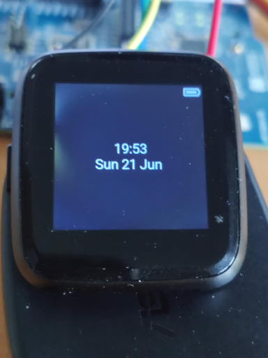

# PineTime Hypnos

This is a work-in-progress [Zephyr](https://www.zephyrproject.org/)-based firmware for the
[PineTime](https://www.pine64.org/pinetime/) smartwatch focused on low power consumption.

It started as a fork of endian-albin's [pinetime-hypnos](https://github.com/endian-albin/pinetime-hypnos) and
for now it still is nothing more (have to look for another name sometime; at least when the changes are getting
bit enough).
The original pinetime-hypnos was still the best project to start with.



## Features

- [x] 100 % Free Software
- [x] Low power consumption: 1.38 mA in idle mode (1.28 mA with the heart rate sensor disconnected), which gives a battery life of more than five days.
- [x] Battery status: get state of charge and whether it's charging
- [x] Clock: accurately increment current time
- [x] Button: wake up display
- [x] Touch sensor: tap to light up the display
- [x] Graphics: removed background image, time, date, battery and Bluetooth status using LittlevGL
- [x] Optional debug output via JLink RTT
- [ ] Show notifications from Bluetooth-connected device
- [ ] Set alarm
- [ ] Wrist vibration
- [ ] Firmware update over Bluetooth
- [ ] Quick glance via lift-to-wake (requires a free driver for the accelerometer)
- [ ] Step counting (see above)

## Getting started

Follow Zephyr's [Getting Started Guide](https://docs.zephyrproject.org/latest/getting_started/index.html)
up to step 3) "Get the source code". Here you should run the commands below
instead of the ones in the guide:

```
$ mkdir ~/pinetime-hypnos
$ cd ~/pinetime-hypnos
$ west init -m https://github.com/max00/pinetime-hypnos
$ west update
```

Then complete the remaining steps.

Optionally disable logging to save system resources:
```
$ export LOGGING="off"
```

Build and install the application:

```
$ west build -b pinetime hypnos
$ west flash
```

## Lookup for more informations
Arduino project, at least it sounds promising:
https://github.com/atc1441/ATCwatch

mbed project - according to the gif it should support touch position detection
https://github.com/sethitow/mbed-pinetime

## Copying

The Hypnos application is under the Mozilla Public License 2.0 and
the documentation, including this README, is CC BY-SA 4.0 or any later version.

Everything else should be under Apache 2.0, MIT/Expat, 3-clause BSD or similar
permissive licenses. Look for SPDX lines and check the source tree history
to be sure.

MPL 2.0 is a file-based copyleft license compatible with all commonly used
GNU licenses (LGPL/GPL/AGPL) as well as Apache 2.0.


<br />Image by Opensource.com
